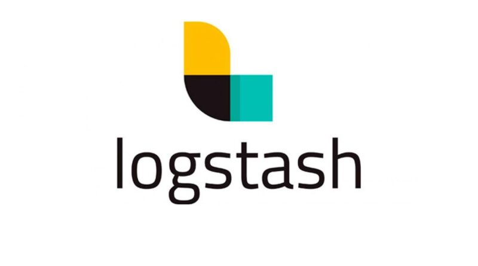
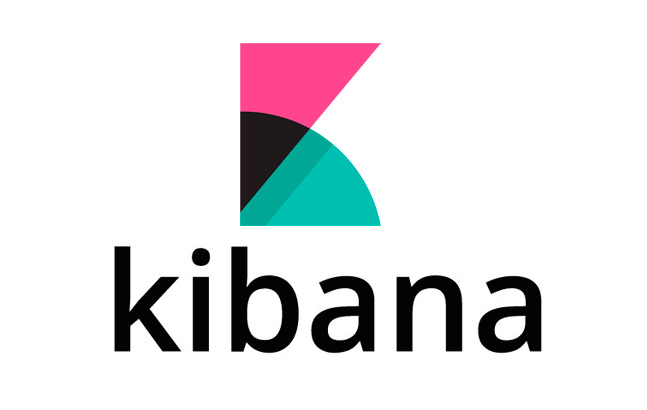
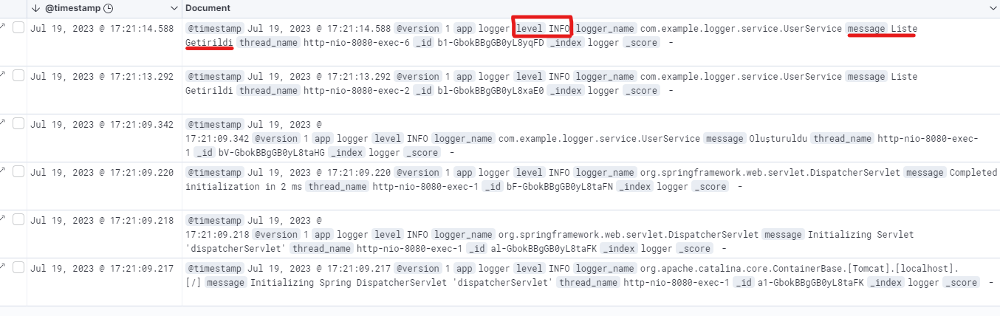

# :triangular_flag_on_post: Elasticsearch-Logstash-Kibana(ELK)

<b> Elasticsearch, Logstash ve Kibana (ELK) birlikte kullanılan açık kaynaklı bir yazılım yığınıdır ve genellikle büyük veri işleme ve analitiği için kullanılır. Her biri, veri yönetimi, arama ve görselleştirme gibi farklı yeteneklere sahip olan farklı ama birbirine entegre bileşenlerdir.</b>

## 🎯 **Elasticsearch**

**Elasticsearch ; text üzerinden doğrudan arama yapmak yerine, indexler üzerinden arama yapar ve çok hızlı bir şekilde sonuçlar üretir. Bunun yanında sorgular üzerinde istatiksel analizler , skorlamalar da yapabilir.**

**JSON belgelerini depolayarak, hızlı bir şekilde büyük miktarda veri arama, analiz etme ve keşfetme yetenekleri sağlar. Verileri gerçek zamanlı olarak indeksler, arama yapma, metin arama, filtreleme, istatistikler oluşturma ve daha fazlasını yapma imkanı sunar. Elasticsearch, performansı yüksek, ölçeklenebilir ve yüksek kullanılabilir bir yapıya sahiptir.**

<b><i>Daha detaylı bilgi almak için diğer elasticsearch repoma bakabilirsiniz.</i></b> 

:pushpin: https://github.com/BurhanKavak/Spring-Elasticsearch

## 🎯 **Logstash**

**Logstash bir veri toplama pipeline aracıdır. Topladığı bu verileri anlamlı hale getirir ve ElasticSearch’ü besler. Bunun yanı sıra topladığı verileri mail adresine, endpoint’e ya da bir başka NoSQL veritabanına gönderebilir.**

**Logstash, günlükler, metin dosyaları, veritabanları, mesaj sıraları ve daha fazlası gibi kaynaklardan verileri toplar, filtreler ve belirli bir formatta Elasticsearch'e gönderir. Aynı zamanda veri dönüştürme ve temizleme işlemleri yapmak için geniş bir eklenti ekosistemine sahiptir.**

## 🎯 **Kibana**

<b> Kibana, Elasticsearch verilerini görselleştirmek, analiz etmek ve keşfetmek için bir web arayüzüdür. Kullanıcılar, Kibana üzerinden Elasticsearch'e kaydedilmiş verilere hızlı ve kolay erişim sağlayabilirler. Kibana, interaktif grafikler, tablolar, haritalar, gösterge panoları ve daha fazlasını oluşturarak verileri görselleştirebilir. Ayrıca, kullanıcılar Elasticsearch sorguları ve filtrelemeleri kullanarak verilere derinlemesine arama ve analiz yapabilirler. </b>

***ELK yığını, günlük yönetimi, uygulama izleme, güvenlik analitiği, iş zekası, metin madenciliği ve daha birçok alanda kullanılabilir. Bu yazılım bileşenleri, geniş bir özellik kümesi ve esneklik sağladığından, farklı veri kaynakları ve kullanım senaryolarına uyarlanabilirler.***

***ELK yığını, büyük veri işleme ve analitiği için kullanılan popüler bir çözümdür ve veri keşfi, hata ayıklama, sorun giderme ve performans izleme gibi birçok alanda değerli bilgiler sunabilir.***

## 🎯 **Kibana Ekranı ve Loglar**
